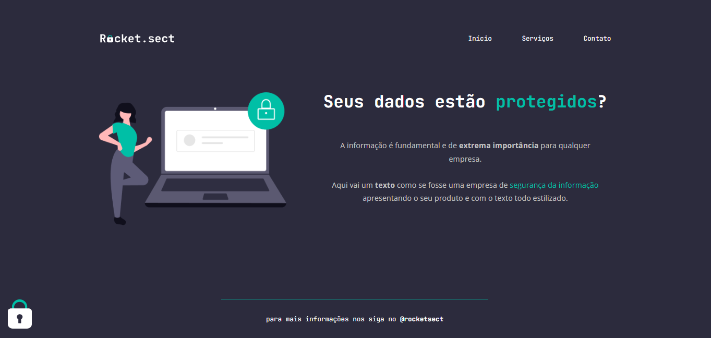

<h1 align="center">🔗 Rocket.sect 🔗</h1>

Criação de uma página WEB seguindo as instruções do design do figma. Esse projeto foi desenvolvido no programa <a href="https://www.rocketseat.com.br/explorer">Explorer</a> da RocketSeat.

  <a href="#🚀-tecnologias">Tecnologias</a>&nbsp;&nbsp;&nbsp;|&nbsp;&nbsp;&nbsp;
  <a href="#💻-projeto">Projeto</a>&nbsp;&nbsp;&nbsp;|&nbsp;&nbsp;&nbsp;
  <a href="#🔖-layout">Layout</a>&nbsp;&nbsp;&nbsp;

 

  

## 🚀 Tecnologias

Esse projeto foi desenvolvido com as seguintes tecnologias:

- HTML e CSS
- Figma

## 💻 Projeto

O Rocket.sect é um projeto que tem como objetivo ensinar os fundamentos essenciais de HTML e CSS. Além disso, concentramos nossos esforços em garantir que o código seja desenvolvido de maneira semanticamente correta.

- [Acesse o projeto finalizado, online](https://jp-xaxa.github.io/)

## 🔖 Layout

Você pode visualizar o layout do projeto através [DESSE LINK](<https://www.figma.com/file/Ny9KAJaCdQ1euLyQYTacq7/Explorer-(Copy)?type=design&node-id=16-106&mode=design&t=K7W5FsKMWtzssJLX-0>). É necessário ter conta no [Figma](https://figma.com) para acessá-lo.

